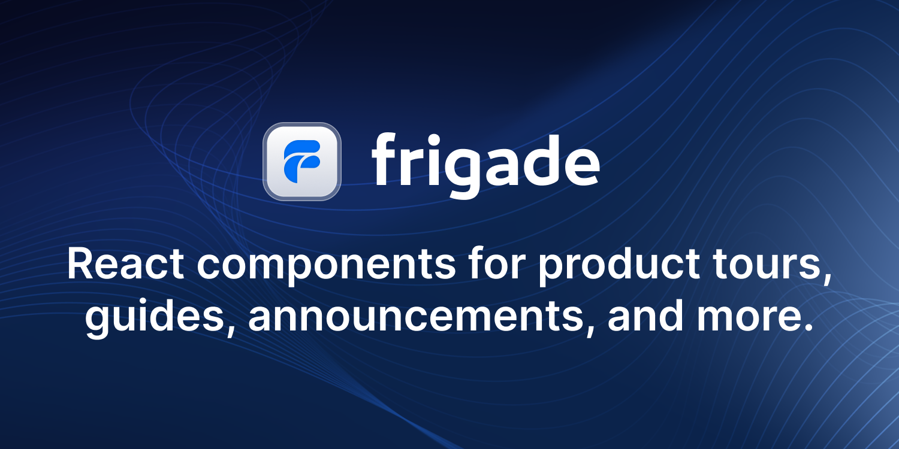
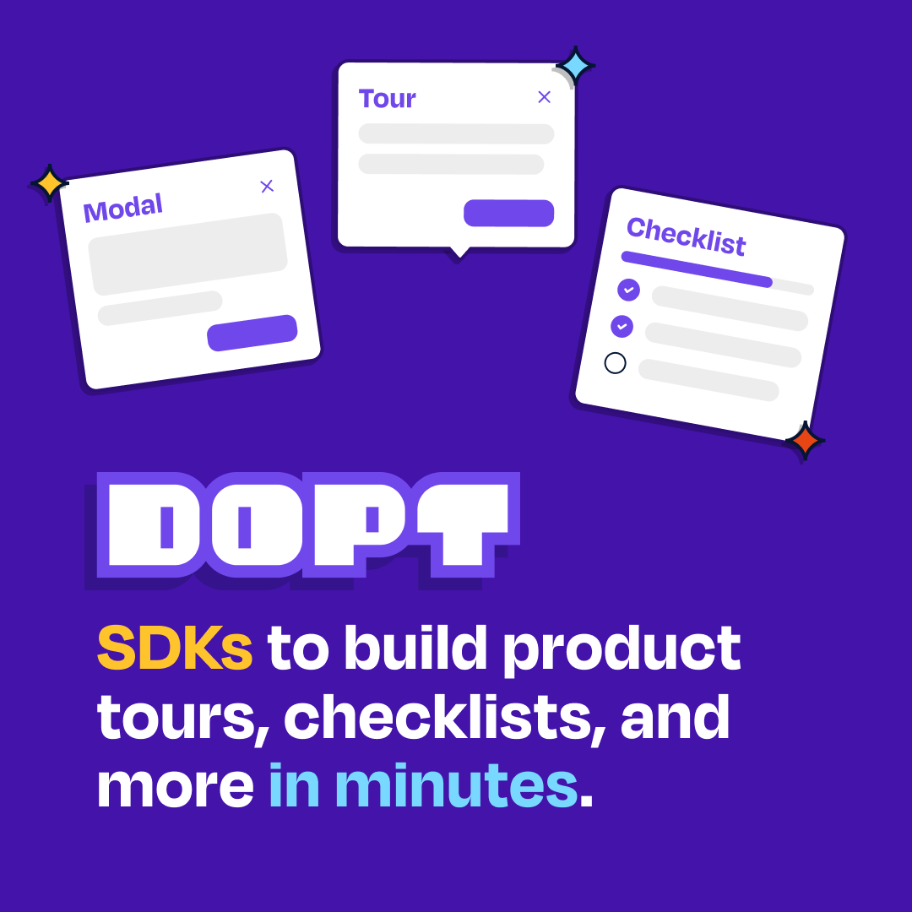

  

  <strong>Tourist Guide</strong> and a set of <strong>Assistants</strong> to travel into your React Components

## Documentation

https://docs.react.tours

For additional help - https://chat.collectivai.com/elrumordelaluz/reactour

## Packages

### [@reactour/tour](https://github.com/elrumordelaluz/reactour/tree/main/packages/tour)

The main package, which uses the other ones to highlight parts of your application from an array of steps.

### [@reactour/mask](https://github.com/elrumordelaluz/reactour/tree/main/packages/mask)

A customizable Component to highlight certain element or area of the viewport.

### [@reactour/popover](https://github.com/elrumordelaluz/reactour/tree/main/packages/popover)

A customizable Component to attach to an element or position of the viewport to show content.

### [@reactour/utils](https://github.com/elrumordelaluz/reactour/tree/main/packages/utils)

A set of helper functions used by the other packages.

### [apps/web](https://github.com/elrumordelaluz/reactour/tree/main/apps/web)

The place where all the stuff is visible working, live [here](https://www.react.tours).

## Sponsored by

#### Gold sponsors 🥇

  

  Reactour is proud to be sponsored by  <a href="https://frigade.com/?source=reactour">Frigade</a>, a developer tool for building better product onboarding: guided tours, getting started checklists, announcements, and more.

#### Silver sponsors 🥈

  

  <a href="https://www.dopt.com/?source=reactour">Dopt</a> gives developers UI components and SDKs to build seamless onboarding and education experiences in minutes.

## Repo Activity

## License

MIT © [Lionel Tzatzkin](https://elrumordelaluz.com)
