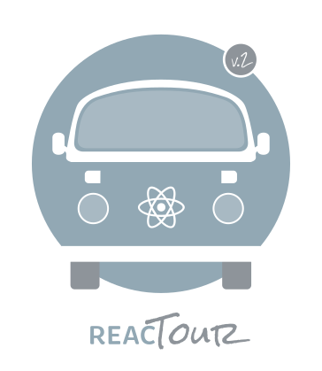

  

  <strong>Tourist Guide</strong> and a set of <strong>Assistants</strong> to travel into your React Components

### Packages

[@reactour/mask](/packages/mask) a customizable Component to highlight certain element or area of the viewport

[@reactour/popover](/packages/popover) a customizable Component to attach to an element or position of the viewport to show conten

[@reactour/tour](/packages/tour) the main responsible package, which uses the other ones to highlight parts of your application from an array of steps

[@reactour/utils](/packages/utils) a set of helper functions used by the other packages

[@reactour/playground](/packages/playground) the place where all the stuff is visible working

#### License

MIT © [Lionel Tzatzkin](https://lionel.tzatzk.in)
